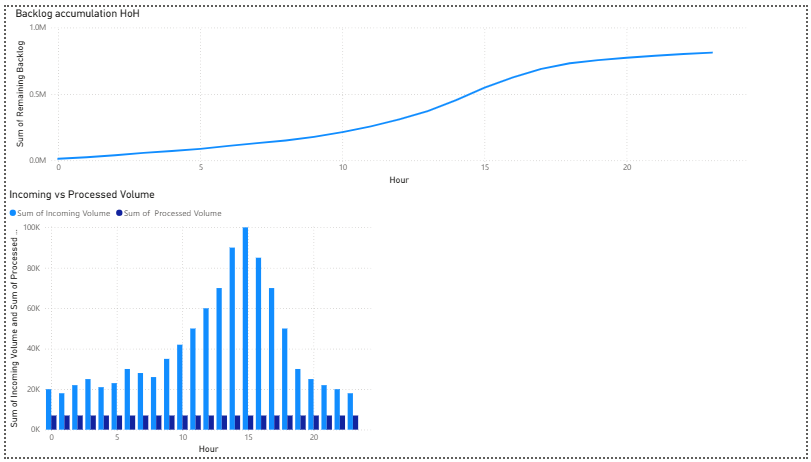

# Backlog Capacity Simulation

## Objective

This project simulates inbound operations under fixed dock capacity to understand how backlog builds across hours when demand exceeds processing capability.

---

## Dataset

* Hour-level inbound volume for a single day
* Fixed processing capacity of 7,000 units per hour (7 docks)
* Backlog carried forward hour by hour

---

## Approach

* Modeled incoming volume vs processing capacity
* Calculated processed volume using system constraints
* Simulated backlog accumulation across 24 hours

---

## Key Findings

* Incoming volume significantly exceeds processing capacity during peak hours
* Backlog increases continuously and is not cleared within the day
* System operates under persistent overload conditions

---

## Conclusion

The current site capacity is insufficient to handle inbound demand.
Operations cannot clear backlog within a 24-hour cycle, indicating a structural bottleneck.

---

## Recommendation

* Increase dock capacity to handle peak demand
* OR redistribute inbound volume to alternate sites
* Introduce scheduling controls to reduce peak load

---

## Dashboard Preview

